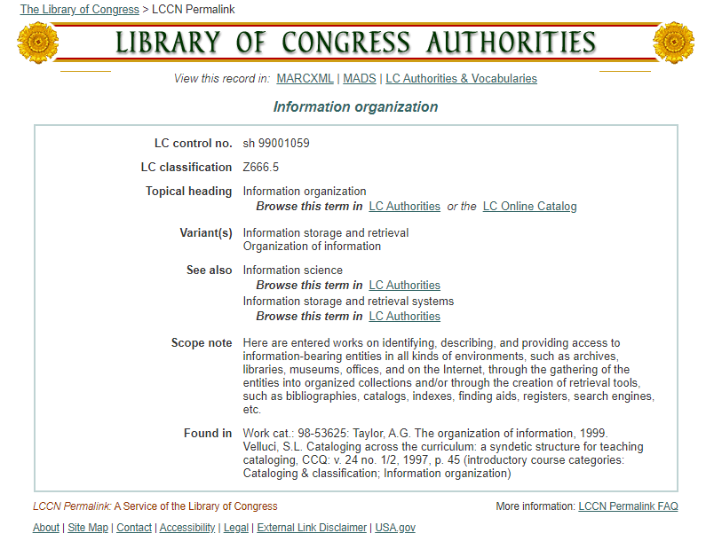

---
jupyter:
  jupytext:
    text_representation:
      extension: .md
      format_name: markdown
      format_version: '1.3'
      jupytext_version: 1.10.2
  kernelspec:
    display_name: Python 3
    language: python
    name: python3
---

# What Is Organization of Information?

Organization of information is a pillar of librarianship and essential for work in all kinds of cultural heritage institutions. Wikipedia has an entry on the topic that serves as a decent point of departure ([https://en.wikipedia.org/wiki/Knowledge\_organization (Links to an external site.)](https://en.wikipedia.org/wiki/Knowledge_organization)):

> **Knowledge organization** (**KO**), **organization of knowledge**, **organization of information**, or **information organization** is an intellectual discipline concerned with activities such as [document description (Links to an external site.)](https://en.wikipedia.org/wiki/Documentation_science "Documentation science"), [indexing (Links to an external site.)](https://en.wikipedia.org/wiki/Bibliographic_index "Bibliographic index"), and [classification (Links to an external site.)](https://en.wikipedia.org/wiki/Library_classification "Library classification") that serve to provide systems of representation and order for knowledge and information objects.
> 
> Wikipedia, "Knowledge Organization"

You'll have a chance to read through the Wikipedia article for Knowledge organization next, but you can navigate there now if you're curious to read more right away! **Once you're ready, come back to this page to continue to think about what this might mean.**

This class is called _Organization of Information_, but according to this Wikipedia entry, there are a number of different ways of naming this idea -- two include the word "information" and two include the word "knowledge." Over the course of this module, you will see why this class chooses to focus on "information" rather than on "knowledge," even if the terms can be used synonymously.

Of the "activities" mentioned in the introduction to that Wikipedia article, all are very tightly tied to what is covered in this class.

*   All of the activities listed _describe_ some kind of **resource** or **document**. This involves, among other things, providing structured information about the resource.
*   The _descriptions_ are then **stored** in some kind of **system** where they can be **discovered** and **retrieved.** This ultimately allows **users** to find and access the resources. 
*   In information agencies and cultural heritage institutions, the description of resources and related work is carried out by information professionals, who act as **information intermediaries**. With this work, a number of **ethical concerns** emerge that must be considered as well.

In broad strokes, those are the topics that will be covered in this class.

## Organization of Information in Libraries and Archives

The [Library of Congress (Links to an external site.)](https://loc.gov/) is a good source of information about the _organization of information_.

The authority record in the screenshot below is for the _Library of Congress Subject Heading_ (LCSH) "Information organization." You may be familiar with LCSH terms from seeing them used in your local library catalog. Did you know that information professionals keep a master list of these LCSH terms (called an authority file) to ensure that every time the LCSH term is used in a catalog or system, it is used correctly?

These master lists of terms/authority files are made up of authority records like the one for "Information organization" in the screen shot. Information intermediaries like catalogers will consult these records when they are organizing information. If you have never worked as a cataloger, you have probably never seen one of these authority records before! 

Take a close look at the information about the LCSH term "Information organization" provided here. What can you tell from this record? In what ways is the content similar to the information from the Wikipedia article in terms of kind of information provided (e.g., synonyms)? What about the kinds of professional work each says is involved?

[](https://lccn.loc.gov/sh99001059)

Authority records, such as this one, often include variations of the term (e.g., Information storage and retrieval), references to related terms (e.g., Information storage and retrieval systems), and "scope notes." Read the scope note, which gives the parameters for the use of "information organization" as a subject term:

> ... identifying, describing, and providing access to information-bearing entities in all kinds of environments, such as archives, libraries, museums, offices, and on the Internet, through the gathering of the entities into organized collections and/or through the creation of retrieval tools, such as bibliographies, catalogs, indexes, finding aids, registers, search engines, etc.

The environments mentioned will be a focus in this class. As you can imagine, they all have slightly different approaches, partly because the users and the information described are very different.

For example in archives, information professionals talk about arrangement and description as part of _processing_ materials, rather than the _organization of information_ . Below is the text of the Society of American Archivists (SAA) thesaurus entry for [processing (Links to an external site.)](https://www2.archivists.org/glossary/terms/p/processing):

> processing
> ----------
> 
> **Relationships**
> 
> **Narrower Term:**  
> [arrangement (Links to an external site.)](https://www2.archivists.org/glossary/terms/a/arrangement)  
> [description (Links to an external site.)](https://www2.archivists.org/glossary/terms/d/description)
> 
> **Related Term:**  
> [archival processing (Links to an external site.)](https://www2.archivists.org/glossary/terms/a/archival-processing)  
> n. –1. The arrangement, description, and housing of archival materials for storage and use by patrons. –2. The steps taken to make the latent image on exposed photographic or microfilm materials visible; see archival processing1. –3. Computing · The machine execution of instructions in a computer program.
> 
> **Notes:**  
> Some archives include accessioning as part of processing.
> 
> **Citations:**  
> †([Ford (Links to an external site.)](https://www2.archivists.org/glossary/source/ford)) A collective term used in archival administration that refers to the activity required to gain intellectual control of records, papers, or collections, including accessioning, arrangement, culling, boxing, labeling, description, preservation and conservation.

The scope note also mentions "information-bearing entities" and includes a list of retrieval tools: bibliographies, catalogs, indexes, finding aids, registers, search engines, etc. Those will be a focus of this class, too. 

In short, organizing information means doing work that allows the users to find the resource they are seeking. In information agencies, this work is carried out by _information intermediaries_.

### 
**IO or OI?**

**Is it Organization of Information (OI) or Information Organization (IO)—or something else?** This text will call it IO—the logical counterpart to IR (Information Retrieval), the well-established initialism used to describe the field that is the other side of the coin, so to speak. You can also just say "Info Org" and everyone gets what you mean.

#### **Next**

_You will take a closer look by reading the Wikipedia article mentioned and looking at the authority record for the Library of Congress Subject Heading "Information organization."_

```python

```
