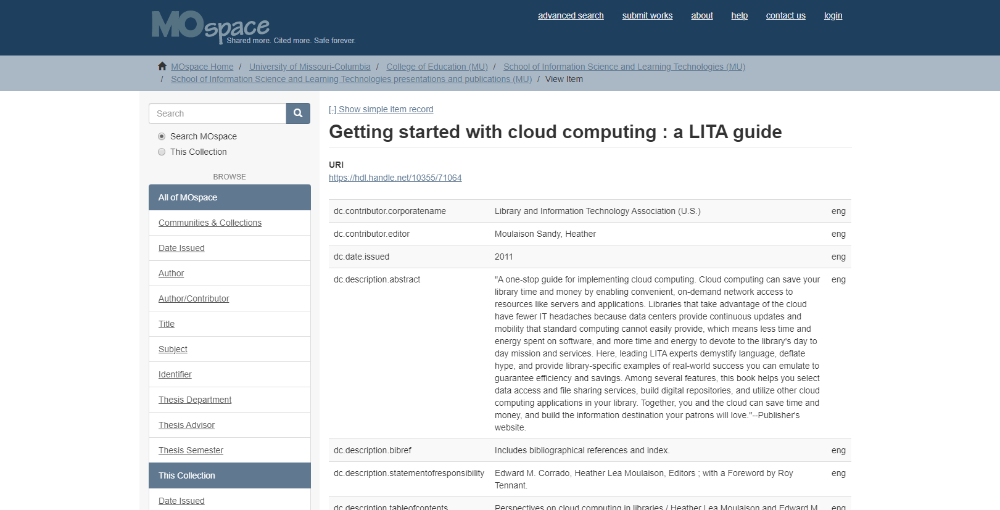

---
jupyter:
  jupytext:
    text_representation:
      extension: .md
      format_name: markdown
      format_version: '1.3'
      jupytext_version: 1.10.2
  kernelspec:
    display_name: Python 3
    language: python
    name: python3
---

# Key Ideas in IR: Records, Fields, and Surrogates for Information Resources

## Records and Surrogates

The previous definition of databases indicated that databases include _**records.**_ The relevant definition of [records](https://www.abc-clio.com/ODLIS/odlis_r.aspx#record) in the ODLIS is

> In computing, a collection of related [data](https://www.abc-clio.com/ODLIS/odlis_d.aspx#data) [fields](https://www.abc-clio.com/ODLIS/odlis_f.aspx#field) organized and [accessible](https://www.abc-clio.com/ODLIS/odlis_a.aspx#accessibility) as a single entity. A [machine-readable data file](https://www.abc-clio.com/ODLIS/odlis_m.aspx#mrdf) is a collection of such records.

In the ERIC database you just looked at, each record represents an article: [https://eric.ed.gov/?q=lady+gaga&id=EJ1101453 ](https://eric.ed.gov/?q=lady+gaga&id=EJ1101453)

And when you clicked on the records to open them, you saw very organized content laid out in a pre-defined way. In fact, you were looking at a display for the fields that compose the record.

#### Fields in Database Records

As mentioned, surrogates are a kind of record in a database. All database records tend to have fields, or "a logical unit of information"; ... "for example, the name, address, or phone number field"—in your Contacts in your phone, or in any number of other systems (["Field", n.d.](https://www.abc-clio.com/ODLIS/odlis_f.aspx#field)). 

Fields is a term that can mean different things in the information professions. Here are two definitions of field ([https://www.abc-clio.com/ODLIS/odlis\_f.aspx#field](https://www.abc-clio.com/ODLIS/odlis_f.aspx#field)) from the ODLIS that pertain to database records: 

> [**field**](https://www.abc-clio.com/ODLIS/odlis_f.aspx#field)  
> In [library](https://www.abc-clio.com/ODLIS/odlis_l.aspx#library) [cataloging](https://www.abc-clio.com/ODLIS/odlis_c.aspx#cataloging), a relative location of [fixed](https://www.abc-clio.com/ODLIS/odlis_f.aspx#fixedfield) or [variable](https://www.abc-clio.com/ODLIS/odlis_v.aspx#variablefield) length in a [machine-readable](https://www.abc-clio.com/ODLIS/odlis_m.aspx#machinereadable) [record](https://www.abc-clio.com/ODLIS/odlis_b.aspx#bibrecord), reserved for a specific [data](https://www.abc-clio.com/ODLIS/odlis_d.aspx#data) [element](https://www.abc-clio.com/ODLIS/odlis_e.aspx#element) or group of elements that constitute a single logical category of [bibliographic description](https://www.abc-clio.com/ODLIS/odlis_b.aspx#bibdescrip), for example, the [area](https://www.abc-clio.com/ODLIS/odlis_a.aspx#area) of [physical description](https://www.abc-clio.com/ODLIS/odlis_p.aspx#physicaldescrip) reserved for [information](https://www.abc-clio.com/ODLIS/odlis_i.aspx#information) about the physical characteristics of an [item](https://www.abc-clio.com/ODLIS/odlis_b.aspx#bibitem). In the [MARC](https://www.abc-clio.com/ODLIS/odlis_m.aspx#machinecat) record, each field is indicated by a three-digit [tag](https://www.abc-clio.com/ODLIS/odlis_t.aspx#tag), but in the [catalog](https://www.abc-clio.com/ODLIS/odlis_c.aspx#catalogrecord) display, textual [field label](https://www.abc-clio.com/ODLIS/odlis_f.aspx#fieldlabel)s are provided to assist users in identifying the various categories of description. ...   
> Fields for [area](https://www.abc-clio.com/ODLIS/odlis_a.aspx#area)s of description containing more than one data element are divided into [subfields](https://www.abc-clio.com/ODLIS/odlis_s.aspx#subfield). Only about 10 percent of available MARC fields are used in most [bibliographic records](https://www.abc-clio.com/ODLIS/odlis_b.aspx#bibrecord); the other 90 percent are used infrequently. **_See also_**: [control field](https://www.abc-clio.com/ODLIS/odlis_c.aspx#controlfield), [directory](https://www.abc-clio.com/ODLIS/odlis_d.aspx#directory), [leader](https://www.abc-clio.com/ODLIS/odlis_l.aspx#leader), [local field](https://www.abc-clio.com/ODLIS/odlis_l.aspx#localfield), and [variable data field](https://www.abc-clio.com/ODLIS/odlis_v.aspx#variabledata).

> In a more general sense, a logical unit of data that, together with other units, comprises a record in a [database](https://www.abc-clio.com/ODLIS/odlis_d.aspx#database) or other system of [recordkeeping](https://www.abc-clio.com/ODLIS/odlis_r.aspx#recordkeeping), for example, the name, address, or phone number field of each [patron record](https://www.abc-clio.com/ODLIS/odlis_p.aspx#patronrecord) in a library's [patron](https://www.abc-clio.com/ODLIS/odlis_p.aspx#patron) database.

Watch this short video from the ERIC database about searching in the database. Note how the terms "records" and "fields" are used—each is used multiple times so you will need to pay close attention. Also note the term "descriptors" which is another term that will be important to retrieval.


```python
from IPython.display import HTML

HTML('<iframe width="703" height="395" src="https://www.youtube.com/embed/WkUxARnUHn4" frameborder="0" allow="accelerometer; autoplay; clipboard-write; encrypted-media; gyroscope; picture-in-picture" allowfullscreen></iframe>')
```

Databases in information agencies are, overall, consistent in the way they operate for users. These databases have records and the records have searchable fields. Often, the fields are similar from system to system, with fields like "author," "title," and "subject" (or some variant of that term) figuring prominently.

### Surrogates

Think about it: When you search in a library catalog (or in Amazon, for that matter), you do not expect to find the book. 

You find a record that describes the book, and explains where the physical book is in the library (e.g., the call number or location) or a link to the URL where the electronic version of the resource is held. In the case of Amazon, you find how to purchase the book.

In these cases, the database record you are looking at is _specific kinds of record_ because it **stands in for** the book within the retrieval tool. We call this kind of [bibliographic record](https://www.abc-clio.com/ODLIS/odlis_b.aspx#bibrecord) a surrogate. 

Database records can describe all kinds of things: bank balances, flight times, locations of upcoming soccer matches, etc. In information agencies, database records often stand in for a book, a poster, a journal, a video, an article, etc. Here is the entry for [surrogate](https://www.abc-clio.com/ODLIS/odlis_s.aspx#surrogate) in the ODLIS:

> [**surrogate**](https://www.abc-clio.com/ODLIS/odlis_s.aspx#surrogate)  
> A [substitute](https://www.abc-clio.com/ODLIS/odlis_s.aspx#substitution) used in place of an [original](https://www.abc-clio.com/ODLIS/odlis_o.aspx#original) item, for example, a [facsimile](https://www.abc-clio.com/ODLIS/odlis_f.aspx#facsimile) or [photocopy](https://www.abc-clio.com/ODLIS/odlis_p.aspx#photocopy) of a [document](https://www.abc-clio.com/ODLIS/odlis_d.aspx#document) too [rare](https://www.abc-clio.com/ODLIS/odlis_r.aspx#rarity) or fragile to be [handled](https://www.abc-clio.com/ODLIS/odlis_h.aspx#handling) by [library](https://www.abc-clio.com/ODLIS/odlis_l.aspx#library) users or an [abstract](https://www.abc-clio.com/ODLIS/odlis_a.aspx#abstract) or [summary](https://www.abc-clio.com/ODLIS/odlis_s.aspx#summary) that provides desired [information](https://www.abc-clio.com/ODLIS/odlis_i.aspx#information) without requiring the [reader](https://www.abc-clio.com/ODLIS/odlis_r.aspx#reader) to examine the entire [document](https://www.abc-clio.com/ODLIS/odlis_d.aspx#document). In [preservation](https://www.abc-clio.com/ODLIS/odlis_p.aspx#preservation), a surrogate is usually made in a more [durable](https://www.abc-clio.com/ODLIS/odlis_d.aspx#durability) [medium](https://www.abc-clio.com/ODLIS/odlis_m.aspx#medium). In a [library](https://www.abc-clio.com/ODLIS/odlis_l.aspx#library) [catalog](https://www.abc-clio.com/ODLIS/odlis_c.aspx#catalog), the [description](https://www.abc-clio.com/ODLIS/odlis_b.aspx#bibdescrip) provided in the [bibliographic record](https://www.abc-clio.com/ODLIS/odlis_b.aspx#bibrecord) serves as a surrogate for the actual physical [item](https://www.abc-clio.com/ODLIS/odlis_b.aspx#bibitem).

```{admonition} Example Surrogate
One example of a surrogate that stands in for a book on Amazon ([click here](https://www.amazon.com/Where-Crawdads-Sing-Delia-Owens/dp/0735219095/ref=sr_1_2?crid=AN4MHQCGSNUN&keywords=where+the+crawdads+sing&qid=1580220663&s=books&sprefix=where+the+cra%2Cstripbooks%2C189&sr=1-2)). The web page isn't the book itself, but the information provided stands in for the book. Amazon also has surrogates for other items, like toothbrushes ([click here](https://www.amazon.com/Philips-Sonicare-ProtectiveClean-Rechargeable-HX6810/dp/B078GVMVRH/ref=sr_1_5?crid=TY248EB2EU3G&keywords=toothbrushes&qid=1580220747&s=hpc&sprefix=toothbrushes%2Cstripbooks%2C167&sr=1-5)). All the surrogates, whether for information-as-thing or other kinds of items  serve the exact same purpose. In the case of a library, they help users find out about the material is accessible at the library. In the case of Amazon, surrogates help potential buyers learn about the merchandise and make a purchase.
```

The screenshot below is another example of a surrogate—this time, a Dublin Core metadata record for a [digital version of a book](https://mospace.umsystem.edu/xmlui/handle/10355/71064?show=full) in the MOspace institutional repository:



In this example of a surrogate, a number of field tags appear in the column on the left. The column on the right includes the data that has been input by the information professional and that is searchable in the system.

Fields in this case include:

*   dc.contributor.corporatename
*   dc.contributor.editor
*   dc.date.issued
*   dc.description.abstract.

These fields are searchable using the search and retrieval functions of the database. If users want to find books **by** the Library and Information Technology Association (U.S.), they could search in the author field, and will not retrieve books **about** "Library and Information Technology Association (U.S.)" where the term would appear in the subject field or title field. Give it a try in MOspace and see for yourself: [https://mospace.umsystem.edu/xmlui/](https://mospace.umsystem.edu/xmlui/)

#### **Next**

_What exactly is going on when these databases are being searched? On the next page, you will learn additional vocabulary terms about databases (not just ones that are available on the web) that will help you express additional ideas about retrieval using the _terms_ of the information professions._

```python

```
