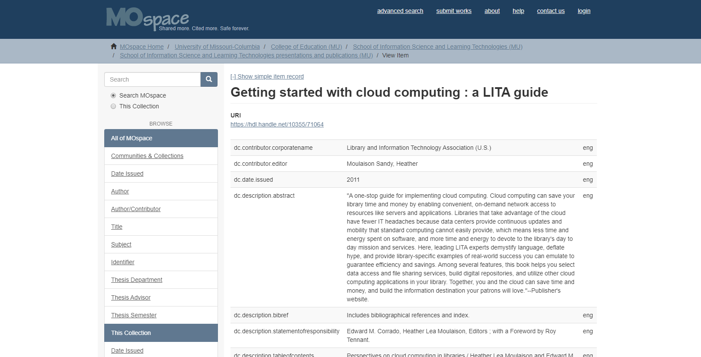

---
jupyter:
  jupytext:
    text_representation:
      extension: .md
      format_name: markdown
      format_version: '1.3'
      jupytext_version: 1.10.2
  kernelspec:
    display_name: Python 3
    language: python
    name: python3
---

<!-- #region id="fJoJ1eQAur97" -->
# Key Ideas in IR: Records, Fields, and Surrogates for Information Resources

## Records and Surrogates

The previous definition of databases indicated that databases include _**records.**_ A database is made up of records, and records are made up of data fields. Some records are constructed to align with standards which are developed to help make the records in multiple kinds of digital environments, an example of a few standards often used in libraries include MARC and Dublin Core. 

In the ERIC database you just looked at, each record represents an article: [https://eric.ed.gov/?q=lady+gaga&id=EJ1101453 ](https://eric.ed.gov/?q=lady+gaga&id=EJ1101453)

And when you clicked on the records to open them, you saw very organized content laid out in a pre-defined way. In fact, you were looking at a display for the fields that compose the record.

#### Fields in Database Records

Database records tend to have fields. For example in the contacts section of your phone there are fields for name, phone number and address for your each of your contacts. Each contact exists as a record. Field, as a term, has different meanings in different information professions. 

In libraries one of the most common records to encounter is a MARC record - MARC stands for MA chine-Readable Cataloging record. Libraries were one of the first professions to shift to computerized system, which is why some of the terminology and infastructure can feel old fashioned in our more mature information age. 

The Library of Congress has a guide to ([Understanding MARC](https://www.loc.gov/marc/umb/um01to06.html#part2)) which asks and answers -

> "Why can't a computer just read a catalog card? The information from a catalog card cannot simply be typed into a computer to produce an automated catalog. The computer needs a means of interpreting the information found on a cataloging record. The MARC record contains a guide to its data, or little "signposts," before each piece of bibliographic information.

These signposts are in reference to fields which in MARC are denoted by tags. These tags are 3 digit numbers such as: 
* 020 which is reserved for the ISBN, 
* 100 for authors name (personal name main entry),
* 245 for title information, 
* 250 for edition, 
* 650 for subject headings
* And many others.

For example - 

| Signposts (Tags)|(Indicators)|(Subfields)| Data                                                    |
|-----------------|------------|-----------|---------------------------------------------------------|
| 100             | 1#         | `$a`        | Arnosky, Jim.                                           |
| 245             | 10         | `$a`        | Raccoons and ripe corn /                                |
|                 |            | `$c`        | Jim Arnosky.                                            |
| 250             | ##         | `$a`        | 1st ed.                                                 |
| 260             | ##         | `$a`        | New York :                                              |
|                 |            | `$b`        | Lothrop, Lee & Shepard Books,                           |
|                 |            | `$c`        | c1987.                                                  |
| 300             | ##         | `$a`        | 25 p. :                                                 |
|                 |            | `$b`        | col. ill. ;                                             |
|                 |            | `$c`        | 26 cm.                                                  |
| 520             | ##         | `$a`        | Hungry raccoons feast at night in a field of ripe corn. |
| 650             | #1         | `$a`        | Raccoons.                                               |
| 900             | ##         | `$a`        | 599.74 ARN                                              |
| 901             | ##         | `$a`        | 8009                                                    |
| 903             | ##         | `$a`        | $15.00                                                  |`


Only about 10 percent of the defined MARC fields are used in most bibliographic records. The above example of a MARC record is closer to the version of a record a library cataloger engages with.

Below is a merlin record for the book Book by Whoopi Goldberg. Click the MARC Display button to see how the record looks in its true form!
<!-- #endregion -->

```python id="wot-Thymur9_" outputId="3c2853bc-c39c-4af7-850d-c7c852131ac1"
from IPython.display import HTML
HTML('<iframe width="90%" height="400px" src="http://merlin.lib.umsystem.edu/record=b3666272~S8"><iframe>')
```

<!-- #region id="oxuAJdmyur-B" -->
Watch this short video from the ERIC database about searching in the database. Note how the terms "records" and "fields" are used—each is used multiple times so you will need to pay close attention. Also note the term "descriptors" which is another term that will be important to retrieval.
<!-- #endregion -->

```python id="vDPbGnMFur-C" outputId="bfd59847-0bb5-406a-8382-ab76cac70d3b"
from IPython.display import HTML

HTML('<iframe width="703" height="395" src="https://www.youtube.com/embed/WkUxARnUHn4" frameborder="0" allow="accelerometer; autoplay; clipboard-write; encrypted-media; gyroscope; picture-in-picture" allowfullscreen></iframe>')
```

<!-- #region id="O3gr0A1uur-C" -->
Databases in information agencies are, overall, consistent in the way they operate for users. These databases have records and the records have searchable fields. Often, the fields are similar from system to system, with fields like "author," "title," and "subject" (or some variant of that term) figuring prominently.

### Surrogates

Think about it: When you search in a library catalog (or in Amazon, for that matter), you do not expect to find the book, you expect to find a record of the book. 

A record that describes the book, and explains where the physical book is in the library (e.g., the call number or location) or a link to the URL where the electronic version of the resource is held. In the case of Amazon, you find how to purchase the book.

In these cases, the database record you are looking at is _specific kinds of record_ because it **stands in for** the book within the retrieval tool. We call this kind of bibliographic record is a surrogate. 

Database records can describe all kinds of things: bank balances, flight times, locations of upcoming soccer matches, etc. In information agencies, database records often stand in for a book, a poster, a journal, a video, an article, etc. 

In the context of databases a surrogate is the description provided of another item, not the item itself. It provides the library patron a summary or abstract of the desired material and if the surrogate is the record in a library catalog it also provides a Call Number or other access path to discover the item itself. In the context of archives and preservation, a surrogate may be a photocopy of an original document which is fragile and shouldn't be handled.

```{admonition} Example Surrogate
One example of a surrogate that stands in for a book on Amazon ([click here](https://www.amazon.com/Where-Crawdads-Sing-Delia-Owens/dp/0735219095/ref=sr_1_2?crid=AN4MHQCGSNUN&keywords=where+the+crawdads+sing&qid=1580220663&s=books&sprefix=where+the+cra%2Cstripbooks%2C189&sr=1-2)). The web page isn't the book itself, but the information provided stands in for the book. Amazon also has surrogates for other items, like toothbrushes ([click here](https://www.amazon.com/Philips-Sonicare-ProtectiveClean-Rechargeable-HX6810/dp/B078GVMVRH/ref=sr_1_5?crid=TY248EB2EU3G&keywords=toothbrushes&qid=1580220747&s=hpc&sprefix=toothbrushes%2Cstripbooks%2C167&sr=1-5)). All the surrogates, whether for information-as-thing or other kinds of items  serve the exact same purpose. In the case of a library, they help users find out about the material is accessible at the library. In the case of Amazon, surrogates help potential buyers learn about the merchandise and make a purchase.
```

The screenshot below is another example of a surrogate—this time, a Dublin Core metadata record for a [digital version of a book](https://mospace.umsystem.edu/xmlui/handle/10355/71064?show=full) in the MOspace institutional repository:



In this example of a surrogate, a number of field tags appear in the column on the left. The column on the right includes the data that has been input by the information professional and that is searchable in the system.

Fields in this case include:

*   dc.contributor.corporatename
*   dc.contributor.editor
*   dc.date.issued
*   dc.description.abstract.

These fields are similar, but different from MARC. They are searchable using the search and retrieval functions of the database. If users want to find books **by** the Library and Information Technology Association (U.S.), they could search in the author field, and will not retrieve books **about** "Library and Information Technology Association (U.S.)" where the term would appear in the subject field or title field. Give it a try in MOspace and see for yourself: [https://mospace.umsystem.edu/xmlui/](https://mospace.umsystem.edu/xmlui/)

#### **Next**

_What exactly is going on when these databases are being searched? On the next page, you will learn additional vocabulary terms about databases (not just ones that are available on the web) that will help you express additional ideas about retrieval using the _terms_ of the information professions._
<!-- #endregion -->

```python id="vqXNVMxvur-D"

```
