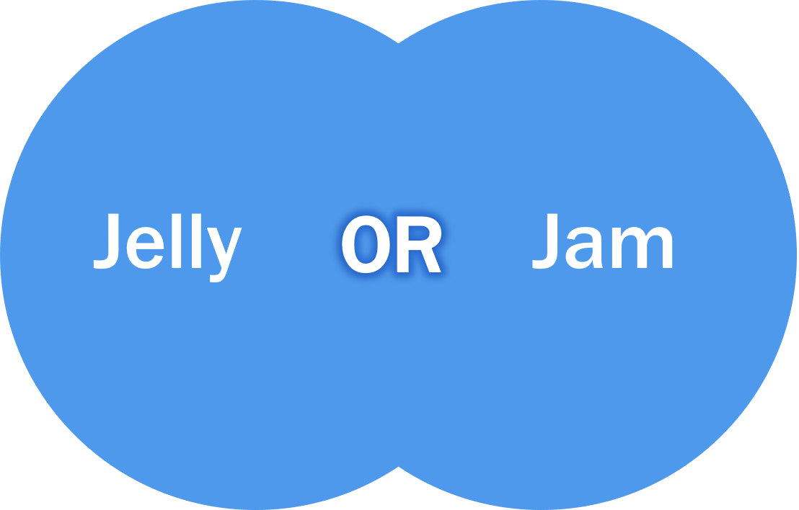
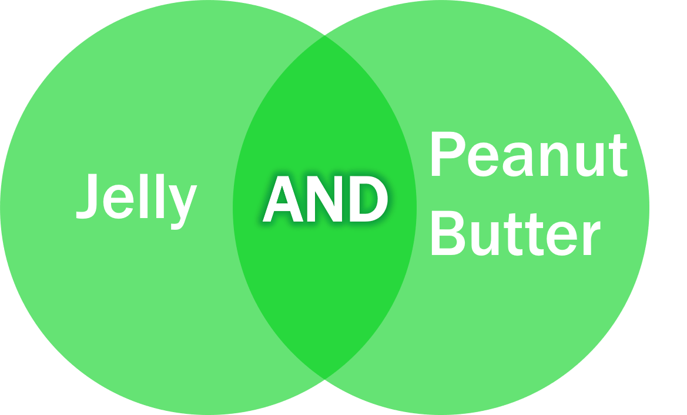

---
jupyter:
  jupytext:
    text_representation:
      extension: .md
      format_name: markdown
      format_version: '1.3'
      jupytext_version: 1.10.2
  kernelspec:
    display_name: Python 3
    language: python
    name: python3
---

<!-- #region id="NfQCNPyIu0xY" -->
# Boolean & Other Tricks

## AND & OR

Put your search together using AND and OR terms (also called boolean terms)

|OR combines related words in a concept<br>OR gets you “more”   | AND combines separate concepts <br> AND is “demanding” (so you get less)  |
|---|---|
|   |    |

Final search:
(semiconductor OR ZnO) AND (nanowire* OR nanostructure* OR nanotech*) AND (“solar cell*” OR photovoltaic*)

## Other Tricks

Building a search:

Truncation (*) – search all possible endings of a word

symbol* → symbol, symbols, symbolism…

Wildcard (?) – replace a single letter

Wom?n → woman, women

Phrases (“”) – search a phrase together<br>
“global warming” → finds exact phrase rather than “global” AND “warming”

Parentheses () – keep OR terms together so that the search combines the OR terms before it adds the AND terms to the search
<br>(cat OR kitten) AND (dog OR puppy)<br>
* Not all databases use parentheses
    
---

The above is from the OER text:
[Advanced Library Skills for Physics Research](https://openeducationalberta.ca/advancedlibsearch/chapter/building-a-search/) by Lauren Stieglitz which is licensed under a Creative Commons Attribution 4.0 International License.
<!-- #endregion -->

```python id="paJS-WEgu0xm"

```
